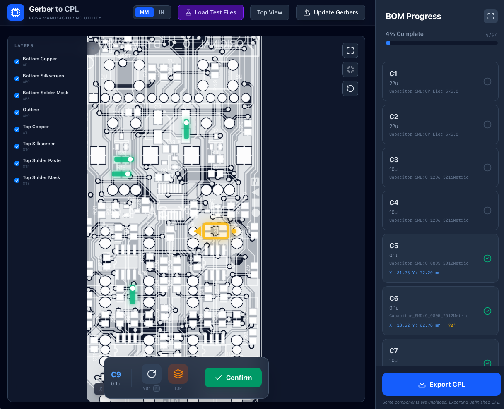

# Gerber to CPL Utility

A powerful web-based tool for PCBA manufacturing that helps you generate accurate Component Placement Lists (CPL) / Centroid files from your Gerber data.



Try it out at: [https://gerber-cpl.pages.dev/](https://gerber-cpl.pages.dev/)

## Features

- **Interactive Gerber Viewer**: Upload your Gerber ZIP file and visualize all PCB layers (Copper, Silkscreen, Solder Mask, Paste).
- **BOM Integration**: Upload your Bill of Materials (CSV) to track which components need placement.
- **Smart Placement**:
  - **Manual**: Click specifically on component pads to capture exact coordinates.
  - **OCR Assistance**: (Experimental) Auto-scan your silkscreen layers to find component designators and estimate locations.
- **Component Rotation**: Rotate components by 90° increments using the **'R'** key shortcut or UI controls. Directional markers (tick-marks with pin-1 pips) show the exact orientation.
- **Unit Conversion**: Seamlessly switch between Millimeters (mm) and Inches (in).
- **Export**: Generate a manufacturing-ready CPL file (CSV) containing Designator, X, Y, Rotation, and Layer (Top/Bottom).

## Getting Started

### Prerequisites
- Node.js (v18 or higher)
- npm

### Installation
1. Clone the repository.
2. Install dependencies:
   ```bash
   npm install
   ```

### Running the App
Start the development server:
```bash
npm run dev
```
Open your browser to `http://localhost:5173` (or the port shown in your terminal).

## Usage Guide

1.  **Upload Gerbers**: Click "Upload Gerbers" and select a `.zip` file containing your Gerber files.
    *   *Tip*: Use the **"Load Test Files"** button (violet button in header) to instantly load a sample project for testing.
2.  **Upload BOM**: In the sidebar, upload your BOM CSV file (Must have a 'Designator' column).
3.  **Place Components**:
    *   Select a component from the sidebar list.
    *   Find the component on the board viewer.
    *   Use the **'R'** key to rotate the component as needed (visualized by the amber ghost indicator).
    *   Click the center of the component to record its location.
    *   The tool auto-advances to the next component.
4.  **Export CPL**: Once finished, click "Export CPL" in the sidebar to download your centroid file.

## Tech Stack
- React
- Vite
- TailwindCSS
- Tracespace (Gerber Rendering)
